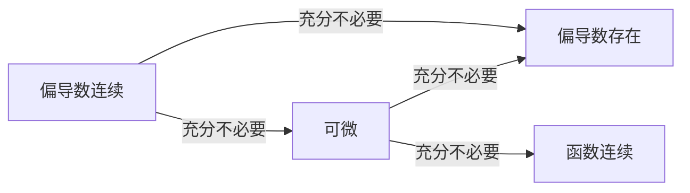

# 多元微分

## 定义

### 偏导数

其他变量视为常数的同时, 对多元函数中**单个变量**求导 (双侧极限)

1. 函数 $f$ 在 $(x_0,y_0)$ 邻域内有定义
2. $\lim\limits_{\Delta x \to 0} \frac{f(x_0 + \Delta x,y_0) - f(x_0,y_0)}{\Delta x}$ 存在

此极限即 $f$ 在 $(x_0,y_0)$ 关于 x 的偏导数, 记为 $\frac{\partial f}{\partial x}$ ($\left. \frac{\partial f}{\partial x} \right|_{\substack{x=x_0 \\ y=y_0}}$) 或 $f'_x$

### 偏微分

函数因**单个自变量变化**产生的线性变化量

$\partial f = \frac{\partial f}{\partial x} \partial x$

### 全微分

函数因**所有自变量同时变化**产生的总线性变化量

若 $z=f(x_1,x_2,\cdots,x_n)$ 的 **全增量** $\Delta z = f(x_1+\Delta x_1, x_2+\Delta x_2,\cdots,x_n+\Delta x_n)-f(x_1,x_2,\cdots,x_n)=\sum{\frac{\partial f}{\partial x_i} \partial {x_i}}+o(\rho)$

 $\rho =\sqrt{\sum \Delta x_i^2}$，则称 $z=f(x,y,\cdots,n)$ 在 $(x_1,x_2,\cdots,x_n)s$ 处可微
 
**全微分** 是 **全增量** 的线性近似, 省略其中 高阶无穷小 $o(\rho)$ 可得:

**全微分**: $\partial z = \sum{f'_{x_i} \partial {x_i}} = \Delta z - o(\rho)$

## 关联

可导而不可微:
1. 从一点出发, 各方向导数不能组成平面(非线性)