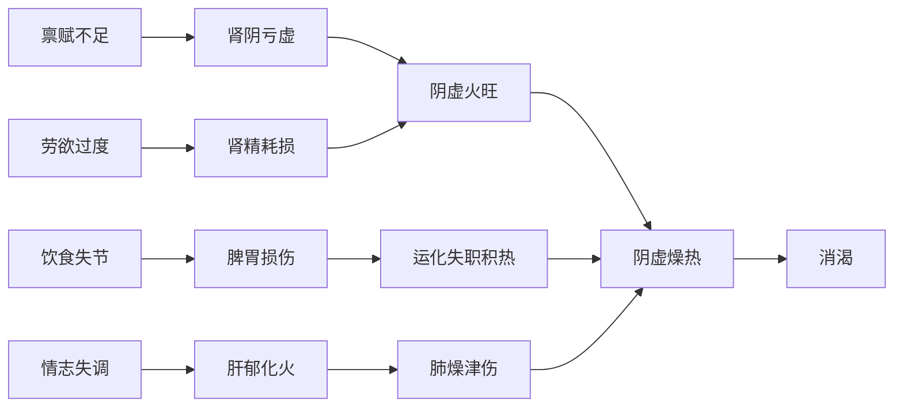

# 消渴

消渴是以多饮，多食，多尿，乏力，消瘦，或尿甜为主症的疾病

- 糖尿病
- 尿崩症

## 病因

- 禀赋不足
- 饮食失节
- 情志失调
- 劳欲过度

## 病机

```mermaid
graph LR


a_1[禀赋不足]
a_2[劳欲过度]
a_3[饮食失节]
a_4[情志失调]
b_1[肾阴亏虚]
b_2[肾精耗损]
b_3[脾胃损伤]
b_4[肝郁化火]
c_1[阴虚火旺]
c_2[运化失职积热]
c_3[肺燥津伤]
d[阴虚燥热]
e[消渴]

a_1 --> b_1
a_2 --> b_2
b_1 --> c_1
b_2 --> c_1
a_3 --> b_3
b_3 --> c_2
a_4 --> b_4
b_4 --> c_3
c_1 --> d
c_2 --> d
c_3 --> d
d --> e


```

## 鉴别

1. 口渴症
2. 瘿病