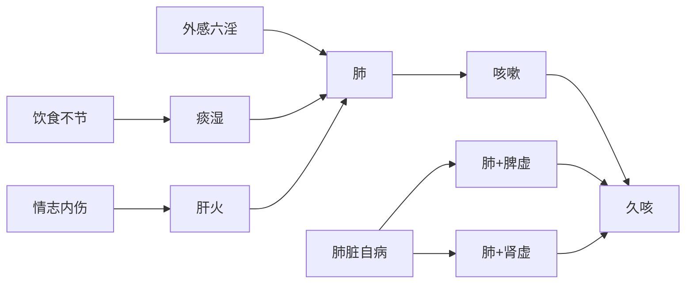

---
tags:
  - 内科/肺系/咳嗽
---

# 咳嗽

咳嗽是以发出**咳声**或伴有**咳痰**为主症的病症

> 有声无痰为咳
> 有痰无声为嗽

## 现代诊断

1. 急性气管-支气管炎
2. 慢性支气管炎
3. 咳嗽变异型咳嗽

## 病因

1. 外感六淫
2. 饮食不节
3. 情志内伤
4. 肺脏自病

## 病机

邪犯于肺，肺失宣降，肺气上逆

## 病位

肺

## 分证

### 外感咳嗽

风寒
风热
风燥

### 内伤咳嗽