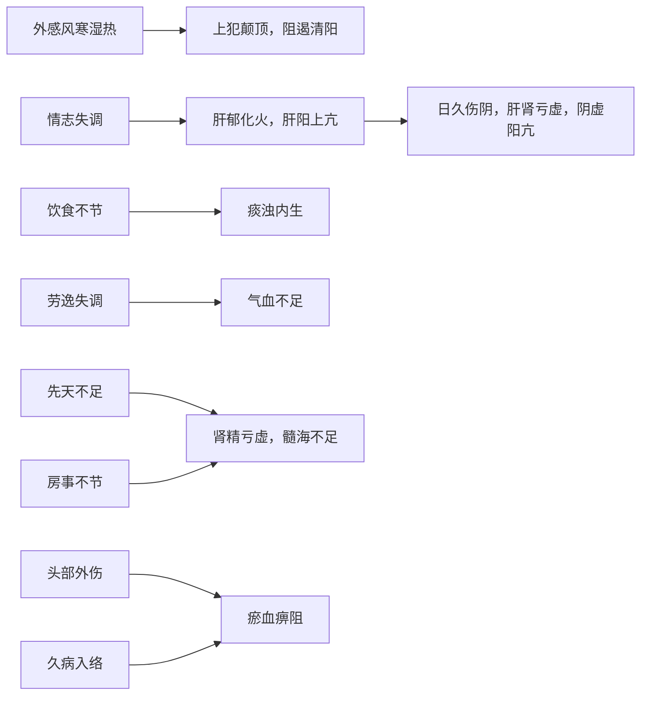

---
aliases:
  - 头风
  - 脑风
  - 首风
  - 真头痛
  - 厥头痛
tags:
  - 脑系
---
# 头痛

自觉头部疼痛为主症的疾病

REF: [头痛](../../../../诊断学/常见症状/疼痛/头痛.md)

## 病因
1. [感受外邪](../../../中医病因/感受外邪.md)
2. [情志失常](../../../中医病因/情志失常.md)
3. [饮食不节](../../../中医病因/饮食不节.md)
4. [劳逸过度](../../../中医病因/劳逸过度.md)
5. [先天不足](../../../中医病因/先天不足.md)
6. [房事不节](../../../中医病因/房事不节.md)
7. [头部外伤](../../../中医病因/外伤.md)
8. 久病入络

## 病机

## 治法

1. 外感头痛：祛风兼散寒，清热，化湿
2. 内伤头痛：
    1. 虚：补养气血，益肾填精
    2. 实：平肝，化痰，行瘀

## 病位

| 头痛类型 | 疼痛部位    |
| ---- | ------- |
| 太阳头痛 | 后脑勺     |
| 阳明头痛 | 前额      |
| 少阳头痛 | 偏头痛     |
| 太阴头痛 | 整头痛(阴痛) |
| 少阴头痛 | 整头痛(剧烈) |
| 厥阴头痛 | 巅顶      |
## 分证

### 外感头痛

1. [风寒头痛](风寒头痛.md)
2. [风热头痛](风热头痛.md)
3. [风湿头痛](风湿头痛.md)

### 内伤头痛

1. [肝阳头痛](肝阳头痛.md)
2. [血虚头痛](血虚头痛.md)
3. [气虚头痛](气虚头痛.md)
4. [痰浊头痛](痰浊头痛.md)
5. [肾虚头痛](肾虚头痛.md)
6. [瘀血头痛](瘀血头痛.md)

## 鉴别

真头痛:
	头痛的特殊重症，起病急，持续剧痛，阵发加重，手足逆冷(肘膝)，甚呕吐如喷，肢厥，抽搐