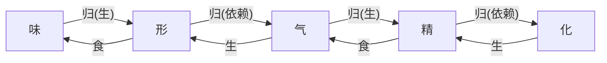

---
tags:
  - 黄帝内经/素问
---
## 核心内容

### 阴阳理论

#### 阴阳

- 万物之纲纪
- 变化之父母
- 生杀之本始
- 神明之府也

治病求本于 **阴阳平衡**

#### 属性

故积阳为天，积阴为地。阴静阳躁。阳生阴长，阳杀阴藏。阳化气，阴成形。寒极生热，热极生寒。寒气生浊，热气生清。

故清阳为天，浊阴为地。

故清阳出上窍，浊阴出下窍；清阳发腠理，浊阴走五藏；清阳实四肢，浊阴归六府

| 阳   | 阴   |
| --- | --- |
| 天   | 地   |
| 云   | 雨   |
| 躁   | 静   |
| 生   | 长   |
| 杀   | 藏   |
| 化气  | 成形  |
| 热   | 寒   |
| 清   | 浊   |
| 出上窍 | 出下窍 |
| 发腠理 | 走五藏 |
| 实四肢 | 归六府 |

天地者，万物之上下也
阴阳者，血气之男女也
左右者，阴阳之道路也
水火者，阴阳之征兆也
阴阳者，万物之能始也

#### 转化

寒极生热，热极生寒。

故清阳为天，浊阴为地。地气上为云，天气下为雨；雨出地气，云出天气。

#### 疾病

清气在下，则生飧泄（完谷不化的泄泻）
浊气在上，则生䐜胀（脘腹胀满）

#### 治疗

| 理论    | 病症   | 治法    |
| ----- | ---- | ----- |
| 清阳出上窍 | 耳目失聪 | 益气升提法 |
| 清阳发腠理 | 表证   | 宣肺发散法 |
| 清阳实四肢 | 手足厥逆 | 温阳法   |
| 浊阴出下窍 | 肠胃积滞 | 攻下法   |
| 浊阴归六府 | 水肿   | 利水逐水法 |

### 形精气化关系

味归形，形归气，气归精，精归化，形食味，精食气，化生精，气生形

#### 伤

味伤形：饮食五味不当、失调、太过，反而伤害形体
气伤精：水谷五味之气失调、不当，寒热温凉太过
气伤于味：五味太过而损伤人体之气

#### 补
形不足者，温之以气
精不足者，温之以味

### 药物属性: 四气五味升降浮沉

味厚者为阴，薄为阴之阳

气厚者为阳，薄为阳之阴

味厚则泄（泄泻大便，大黄），薄则通（通利小便，木通）

气薄则发泄（发汗散表，麻黄），厚则发热（助阳发热，附子）

|     | 厚        | 薄          |
| --- | -------- | ---------- |
| 气   | 阳; 发热 | 阳之阴; 发泄 |
| 味   | 阴; 泄  | 阴之阳; 通  |

气味辛甘发散为阳，酸苦涌泄为阴

#### 壮火&少火

- 壮火：药食气味辛热纯阳者
- 少火：药食气味辛甘温和者

壮火之气衰，少火之气壮；壮火食气，气食少火；壮火散气，少火生气

### 寒热&形气

寒伤形，热伤气，气伤痛，形伤肿

故先痛而后肿者，气伤形也（气先伤，而后及于形体）；先肿而后痛者，形伤气也（形体先伤，而后及于气）

### 五气致病

#### 来源

天有四时五行，以生长收藏，以生**寒暑湿燥风**

人有五藏化五气，以生**喜怒悲忧恐**

#### 内外所伤

喜怒(情志)伤气，寒暑(外淫)伤形；

##### 内

暴怒伤阴，暴喜伤阳

##### 外

风胜则动，热胜则肿，燥胜则干，寒胜则浮，湿胜则濡泻

| 气   | 病   |
| --- | --- |
| 风   | 动   |
| 热   | 肿   |
| 燥   | 干   |
| 寒   | 浮   |
| 湿   | 濡泻  |

### 四时伏气致病

重阴必阳，重阳必阴

冬伤于寒，春必温病
春伤于风，夏生飧泄
夏伤于暑，秋必痎疟
秋伤于湿，冬生咳嗽

| 伏气   | 病     | 转化     |
| ---- | ----- | ------ |
| (冬)寒 | (春)温病 | 重阴->阳病 |
| (春)风 | (夏)飧泄 | 重阳->阴病 |
| (夏)暑 | (秋)痎疟 | 重阳->阴病 |
| (秋)湿 | (冬)咳嗽 | 重阴->阳病 |

参考: [生气通天论](生气通天论.md#四时邪气致病) & [四气调神大论](四气调神大论.md)

### 四时五脏阴阳系统

| 五行  | 五色  | 五气  | 五味  | 五化  | 五方  | 五季  | 五脏  | 五腑  | 五窍/官 | 五体  | 五情  | 五声  | 五音  | 五变       |
| --- | --- | --- | --- | --- | --- | --- | --- | --- | ---- | --- | --- | --- | --- | -------- |
| 木   | 青   | 风   | 酸   | 生   | 东   | 春   | 肝   | 胆   | 目    | 筋   | 怒   | 呼   | 角   | 握        |
| 火   | 赤   | 暑   | 苦   | 长   | 南   | 夏   | 心   | 小肠  | 舌    | 脉   | 喜   | 笑   | 徵   | 忧/嚘 : 气逆 |
| 土   | 黄   | 湿   | 甘   | 化   | 中   | 长夏  | 脾   | 胃   | 口    | 肉   | 思   | 歌   | 宫   | 哕 : 呃逆   |
| 金   | 白   | 燥   | 辛   | 收   | 西   | 秋   | 肺   | 大肠  | 鼻    | 皮毛  | 悲   | 哭   | 商   | 咳        |
| 水   | 黑   | 寒   | 咸   | 藏   | 北   | 冬   | 肾   | 膀胱  | 耳    | 骨   | 恐   | 呻   | 羽   | 栗        |

### 法阴阳

| 阴阳盛衰 | 病变症候                                                                                                                   | 预后  | 因时制宜  |
| ---- | ---------------------------------------------------------------------------------------------------------------------- | --- | ----- |
| 阳盛   | 身热－阳胜的外证  腠理闭，汗不出而热－卫阳被郁，开合失司  喘粗为之俯仰 －邪热迫肺，肺失宣降  齿干－热盛伤津  烦闷－热扰脏腑，神明不安  腹满－热结阳明　　☆胃气    | 死   | 能冬不能夏 |
| 阴盛   | 身寒－阴胜的外证  汗出－阴寒过盛，表阳虚衰，固摄无力，津液外泄  身常清－阴盛阳虚，肌表失于温煦  数栗而寒－寒气内盛  寒则厥－阳气不达四末  厥则腹满－阳气衰败，阴寒内结 | 死   | 能夏不能冬 |

#### 早衰

能知七损八益[^七损八益]，则二者可调
不知用此，则早衰之节也

年四十，而阴气自半也，起居衰矣定（安也）其血气，各守其乡（部位）
血实（瘀血）宜决之
年五十，体重，耳目不聪明矣
年六十，阴痿，气大衰

| 年龄  | 表现       |
| --- | -------- |
| 40  | 阴气自半，起居衰 |
| 50  | 体重，耳目不聪明 |
| 60  | 阴痿，气大衰   |

[^七损八益]: 男女以 8,7 为倍数的年龄规律

#### 养生

知七损八益，调阴阳
为无为之事，乐恬惔之能

### 治法

#### 因势利导

形不足者，温之以气；精不足者，补之以味

其高者 ，因而越之
（病邪在上焦者，可用涌吐之法以祛邪；越者，吐也）

其下者，引而竭之
（病邪在下焦者，可用通利之法以祛邪；竭，尽也）

中满者，泻之于内
（病邪在中焦之痞满，可用消导之法以祛除积滞）

其有邪者，渍形以为汗
（邪在体表者，可用浸浴之法取汗以散邪气）
（渍形，指以热水、药汤等浸浴身体）

其在皮者，汗而发之
（在皮，指邪在皮毛；汗而发之，指发汗法）

其慓悍者，按而收之
（按，抑制；收，收敛、制伏）

其实者，散而泻之
（实证分表里，表实宜散，里实宜泻）

定（安也）其血气，各守其乡（部位）
血实（瘀血）宜决之