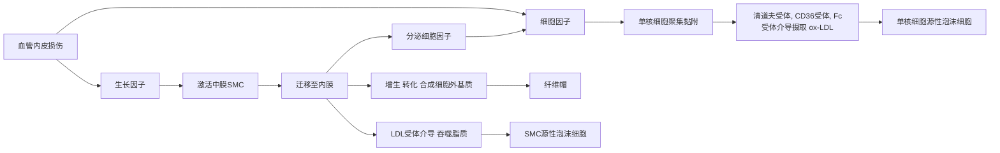

---
aliases:
  - atherosclerosis
  - AS
title: 动脉粥样硬化
categories:
tags:
---

# 动脉粥样硬化

Atherosclerosis (AS) 动脉粥样硬化 是心血管系统疾病 **最常见** 的疾病

特征:
- 血管内膜形成纤维斑块/粥样斑块
- 主要累及 **大, 中动脉**, 管壁硬化, 弹性减弱, 管腔狭窄
- 引起器官缺血性改变

动脉硬化 arteriosclerosis 类型:
1. AS
2. 动脉中层钙化 arterial medial calcification
3. 细动脉硬化 arteriolosclerosis
4. 纤维肌性内膜增生 fibromuscular intimal hyperplasia

## 病因

### [高脂血症](高脂血症.md) Hyperlipidemia

LDL, VLDL 同为 致AS性的脂蛋白

LDL 是引起 AS 的主要因素

LDL 被动脉壁细胞氧化修饰形成: 氧化LDL oxidized LDL (ox-LDL)
目前认为 ox-LDL 是最重要的 致粥样硬化因子
其不能被正常 LDL 受体识别, 易被巨噬细胞的清道夫受体 scavenger receptor 识别并摄取, 形成 **泡沫细胞** foam cell

HDL 对 AS 有预防作用

HDL 通过 胆固醇逆向转运机制 清除动脉壁的胆固醇, 抗氧化作用, 竞争性抑制 LDL 与内皮细胞受体结合减少 LDL 摄取, 防止 AS 发生

### 高血压

高血压 血流对血管壁的机械性压力&冲击 引发血管内皮损伤, 通透性增大
### 吸烟

血液中 $CO$ 浓度增高, 血管内皮细胞缺氧性损伤
使 LDL 易氧化
烟中含一种糖蛋白 激活凝血因子Ⅷ & 致突变物质(血管 [SMC](../../血管平滑肌细胞.md) 增生) 
### 继发高脂血症的疾病

- 糖尿病
- 高胰岛素血症
- 甲状腺功能减退
- 肾病综合征

### 遗传

- 冠状动脉性心脏病 Coronary Artery Heart Disease (CHD)
- 家族性高胆固醇血症
### 性别

雌激素 具有 改善血管内皮, 降低血浆胆固醇 的作用
> 绝经期后同年龄对照性别差异消失
## 机制

### 脂质渗入学说

血浆中增多的 胆固醇, 胆固醇酯 等沉积于动脉内膜, 引起结缔组织增生, 动脉壁增厚, 硬化, 结缔组织坏死形成 **动脉粥样斑块** 

CHD 患者体内以致密小 LDL 为主
此物质易穿透动脉内膜, 与动脉壁基质的 硫酸软骨素蛋白多糖 有强亲和力
此物质抗氧化能力弱
对已存在的斑块作用更明显
### 损伤-应答反应学说

### 动脉平滑肌细胞作用

(AS进展期) SMC 迁入内膜增生, 表型从 收缩型 转变为 合成型, 具有脂蛋白受体, 形成 SMC源性泡沫细胞

SMC 合成胶原蛋白, 蛋白多糖等细胞外基质, 使内膜增厚硬化

### 慢性炎症学说

慢性促炎症因素 慢性炎症导致内皮细胞损害

主要标志: 高敏C反应蛋白 C-reactive protein (CRP)

CRP:
- 刺激内皮细胞表达粘连分子
- 抑制内皮细胞产生 NO
- 增加内皮细胞产生 纤溶酶原激活物抑制物1 (PAI-1)
- 刺激巨噬细胞吞噬 低密度脂蛋白胆固醇 (LDL-C)
- 激活血管紧张素I受体
- 促进平滑肌增殖

## 病理